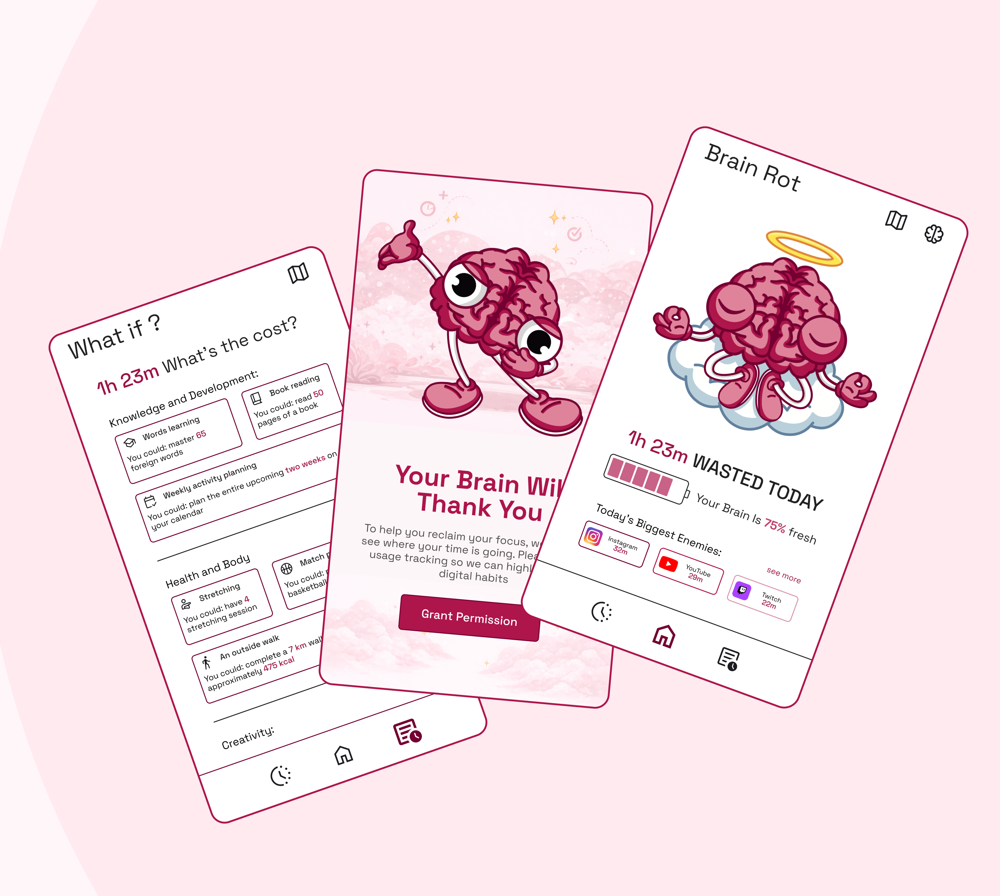
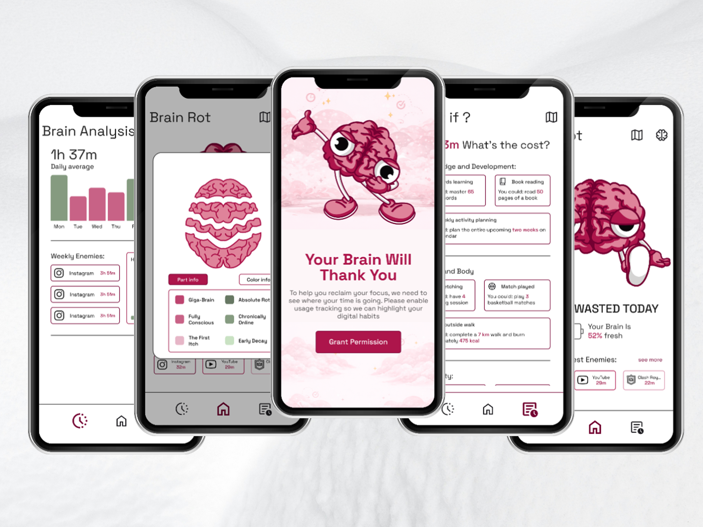

# BrainRot — Track Your Screen Time, Reclaim Your Mind

**BrainRot** is an Android app that helps you understand and reduce excessive screen time by visualizing your digital habits in a fun, engaging, and slightly unsettling way.

Instead of boring stats, BrainRot turns your usage into a **living experience** — your brain literally _changes_ based on how you spend your time.

## ✨ Features

### 1 Smart Screen Time Tracking

Track how much time you spend across different apps and categories:

- Social media
- Games
- Video / streaming
- Productivity & more

Get detailed **daily and weekly breakdowns** of your usage.

---

### 2 Dynamic Brain Visualization

Beyond generic usage stats, your behavior is reflected through an **interactive brain map**:

- Each part of the brain represents a category of apps
- The more time you spend, the more that section evolves
- Watch your brain go from **healthy → rotted** 👀

---

### 3 Insightful Analytics

Stay informed with clear and simple stats:

- Daily usage breakdown
- Weekly averages
- Most-used apps
- “Biggest enemies” (your top time-wasting apps)

---

### 4 Focus Streak System

Build better habits with a streak mechanic:

- Stay under **4 hours/day** to maintain your streak
- Exceed it → streak resets to **0**
- Encourages consistent, mindful usage

---

### 5 “What If?” Time Reclaim Feature

See what your lost time could have been:

- Learn new words
- Read books
- Exercise
- Plan your week
- …and more

Turn wasted hours into **real-world opportunities**.

---

### 6 Adaptive UI & Mascot

The app’s personality evolves with your behavior:

- A cheerful brain when you're in control
- A tired, “rotting” brain when usage spikes
- UI subtly shifts to reflect your digital health

> [!NOTE]
>
> ## Design and Illustrations
>
> All **UI/UX design, illustrations, and visual concepts** in BrainRot were designed and created entirely by me :)
>
> The goal was to make screen time tracking:
>
> - more **emotional**
> - more **visual**

## 📸 Preview

  
  

---

## Install & Try BrainRot

You can quickly try **BrainRot** on your Android device using the **Expo preview build** via QR Code.

---

> [!IMPORTANT]
>
> ### Required Permission (Important)
>
> To enable full functionality:
>
> 1. Open **BrainRot**
> 2. Tap **"Grant Permission"**
> 3. Navigate to:
